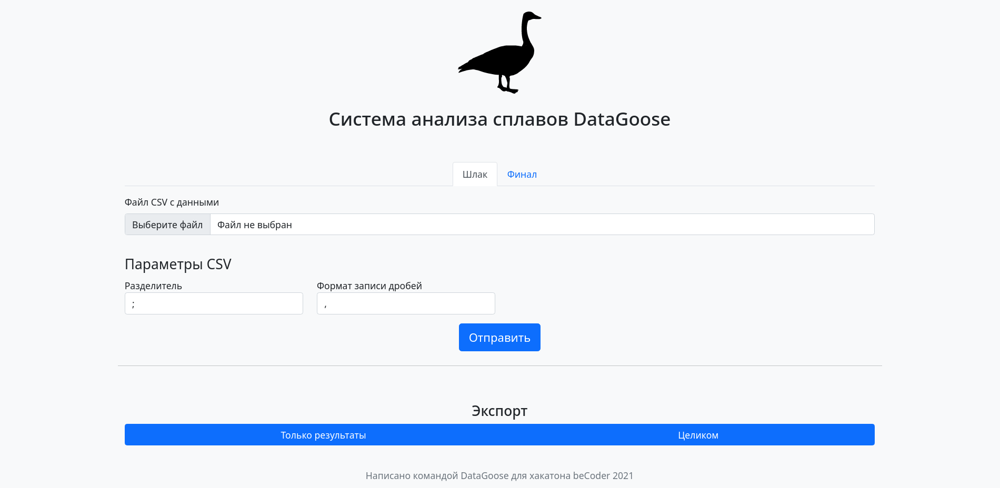

# Прогнозирование химического состава шлака
Задание по Data science от компании EVRAZ (оптимизация сталеплавильного производства) в рамках хакатона ```</beCoder>```.

Мы реализовали наше решение как простой и лаконичный веб-сервис!

